# MongoDB University

A comprehensive collection of notes and resources covering MongoDB data modeling, schema design, and best practices.

## Table of Contents

- [Overview](#overview)
- [NoSQL vs SQL](#nosql-vs-sql)
- [Data Format](#data-format)
- [Data Modeling](#data-modeling)
- [Schema Design](#schema-design)
- [Schema Validation](#schema-validation)
- [Embedding vs Referencing](#embedding-vs-referencing)
- [Design Relationships](#design-relationships)
- [Modeling for Workloads](#modeling-for-workloads)
- [MongoDB Flexibility](#mongodb-flexibility)

## Overview

This repository contains structured notes from MongoDB University courses, covering fundamental concepts of MongoDB data modeling, schema design patterns, and best practices for building efficient MongoDB applications.

## NoSQL vs SQL

Understanding the differences between SQL and NoSQL databases.

| SQL | NoSQL |
|-----|-------|
| Relational model | Document model |
| Fixed schema | Flexible schema |
| ACID transactions | Eventual consistency |
| Vertical scaling | Horizontal scaling |

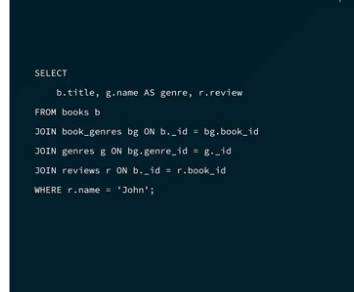
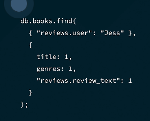

## Data Format

MongoDB uses JSON (JavaScript Object Notation) format for data storage.

- Data is stored in JSON format
- Supports semi-structured, unstructured, and structured data
- Schema flexibility allows changes without checking original schema
- Each document has a unique `_id` identifier
- Keys represent fields in the document

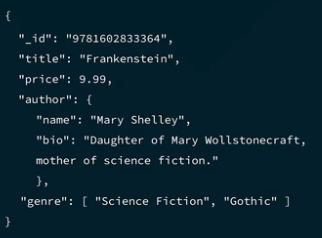
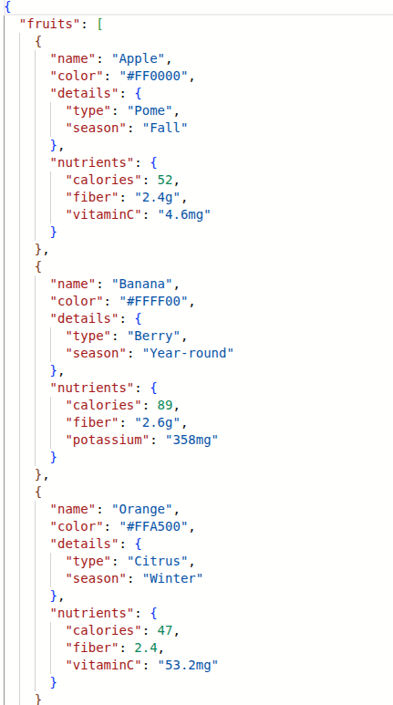

## Data Modeling

Data modeling defines how data is stored, accessed, and managed within your database.

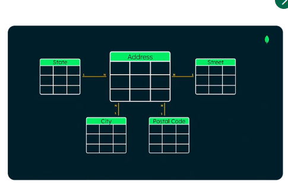
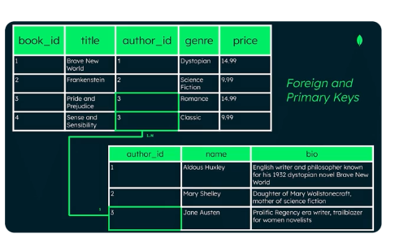

### Key Concepts

- **Entities**: Objects or concepts that exist in the database
- **Attributes**: Properties that describe entities
- **Relationships**: Associations between entities
- **Read/Write Patterns**: Understanding how data will be accessed

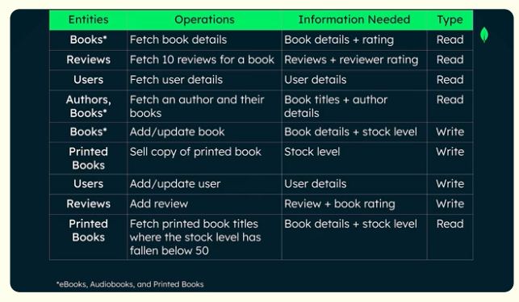
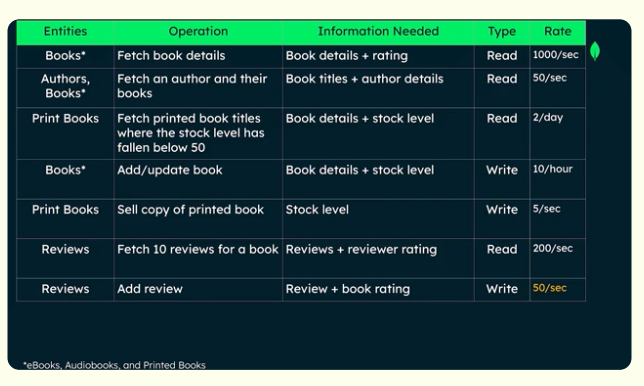

## Schema Design

A schema is a blueprint for how data is organized in the database.

### Schema Process

1. Gathering system requirements
2. Mapping entities and relationships
3. Defining validation rules

## Schema Validation

MongoDB provides schema validation to enforce data integrity.

### Key Features

- Flexible schema with optional validation
- Contract between user and application
- Predictable error handling for schema changes
- Validation applies only to new documents when added to existing collections

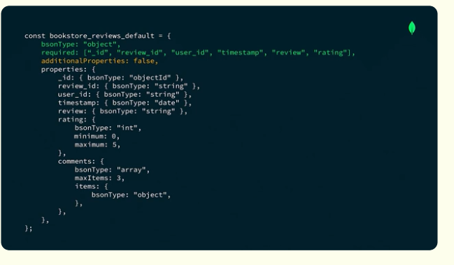

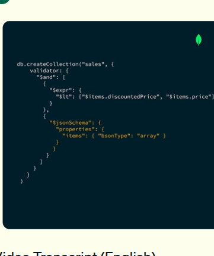

### Validation Rules

- Can use Query Operators or JSON Schema for validation
- `$jsonSchema` operator for comprehensive validation
- Validation actions: error or warn

## Embedding vs Referencing

Two primary approaches for structuring related data in MongoDB.

### Embedding

Putting a document inside another document.

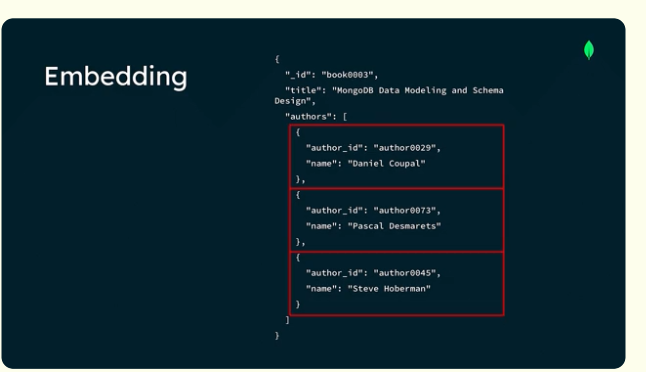
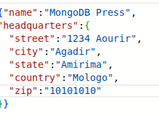
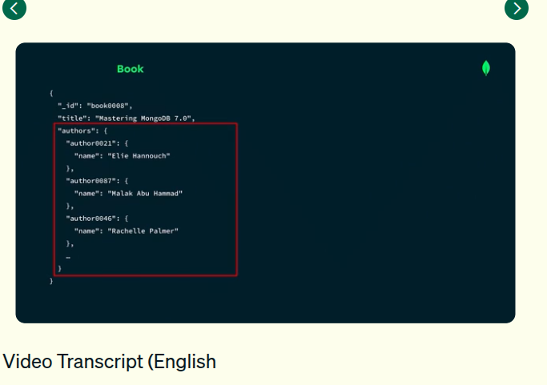
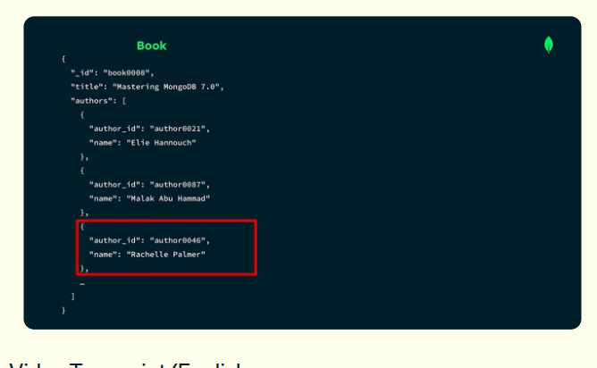

### Referencing

Separate documents linked using a key in different collections.

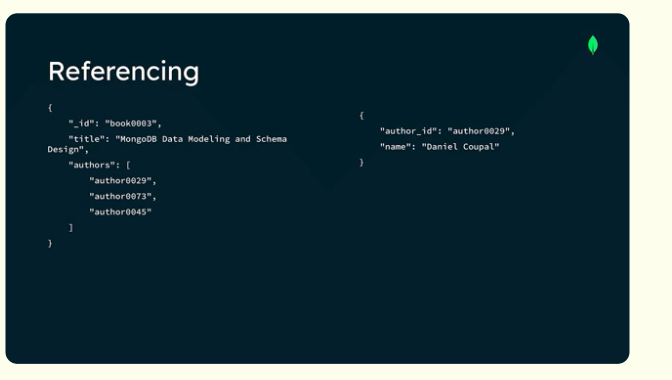
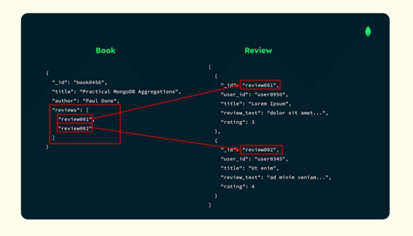
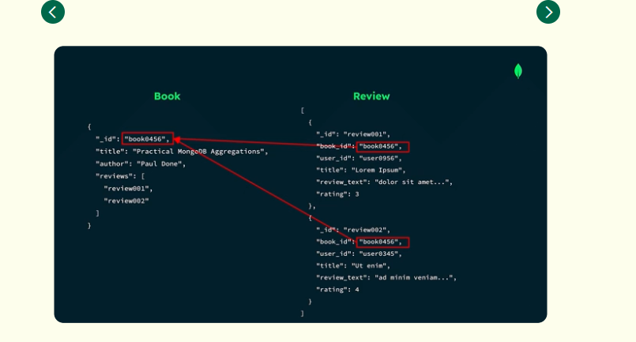
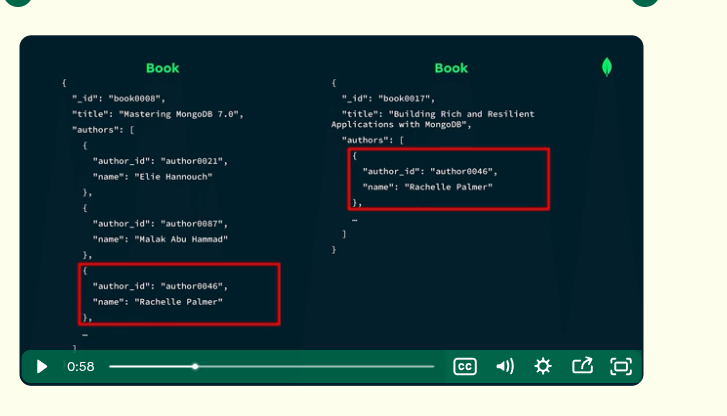

## Design Relationships

Different types of relationships between entities.

### One-to-One

Link between two entities by embedding a child document in a parent one.

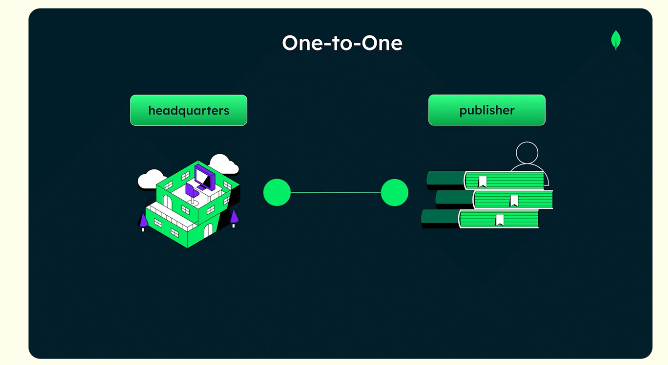

### One-to-Many

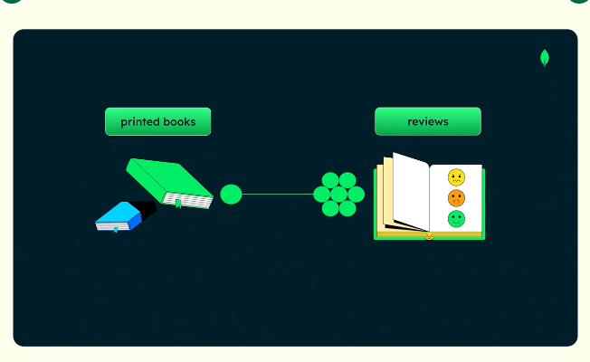
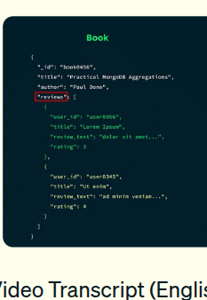

### Many-to-Many

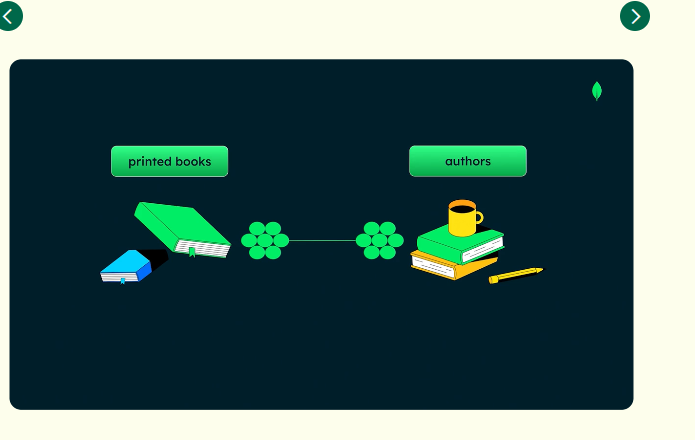

### Relationship Types

- **One-directional**: Data flows in one direction
- **Bidirectional**: Data flows in both directions

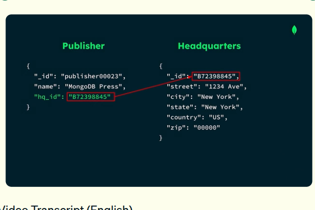
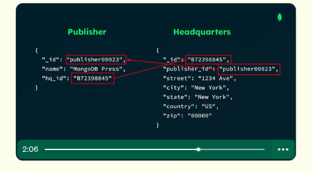

## Modeling for Workloads

Designing data models based on specific workload requirements.

### Process

1. Define entities
2. Quantify read and write operations
3. Define attributes
4. Determine how to read and write entities

### Key Considerations

- **Attributes**: Properties of entities
- **Workload Analysis**: Understanding read/write patterns
- **Performance**: Optimizing for query patterns

## MongoDB Flexibility

MongoDB offers unique flexibility advantages.

### Key Features

- No joins or complex relationships between entities
- Schema flexibility allows evolution without migrations
- Polymorphism support for different document structures
- Embedded documents reduce need for complex joins

## Additional Resources

- [Data Format Documentation](Data%20Format/JSON.md)
- [Schema Validation Guide](Schema%20Validation/Validation%20rules.md)
- [Embedding vs Referencing Guidelines](Embedding%20vs%20Referncing/)
- [Design Relationships](Design%20Relationships/)

## License

This repository is for educational purposes. Content based on MongoDB University courses.

---

**Note**: All screenshots are located in the `attachements/` folder for reference.
